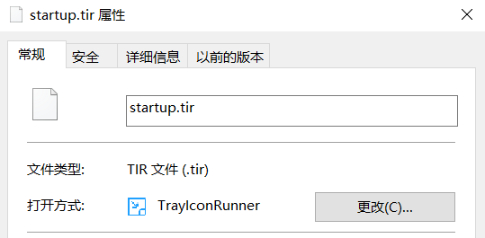
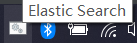

# TrayIconRunner


[](./LICENSE)

[](../../releases)

## 简介
一款可将任何桌面程序的主窗口最小化到托盘区域的工具，其主要原理是先创建托盘图标，然后通过Win32 API来Hook一个进程的窗口事件，并在进程的主窗口被最小化时，隐藏主窗口。当托盘图标被点击时，再重新显示其窗口。

本项目采用GPL-3.0 License，其要求：

- 本项目的衍生项目需采用GPL-3.0 License。
- 必须在修改的文件中附有明确的说明，须包含所修改的部分及具体的修改日期。
- 通过任何形式发布衍生项目的可执行程序时，必须同时附带或公布衍生项目的源代码。

请参阅：[更新日志](./docs/changelog.md)

## 用法
以Elastic Search为例，Elastic Search是通过脚本启动的，启动后会持续保留一个控制台窗口，不便使用。

首先[下载](../../releases/latest)TrayIconRunner的可执行程序，并将其解压到一个目录中。

在其启动脚本所在的目录，即`{安装目录}/bin`目录下，创建一个名为`startup.tir`的文件，在其中输入以下内容并保存。

```json
{
  "file": "elasticsearch.bat",
  "name": "Elastic Search"
}
```

右键`startup.tir`文件，设置其属性，将打开方式更改为TrayIconRunner。



双击打开`startup.tir`，可以看到`elasticsearch.bat`已经被执行，且托盘区域已出现对应的图标。



点击控制台窗口上的最小化按钮，可以看到控制台窗口已被隐藏，任务栏上已没有此控制台窗口的项目。

点击托盘区域的图标，可以看到控制台窗口已恢复显示。

停止Elastic Search的运行脚本，可以看到托盘区域的图标已消失，TrayIconRunner的进程也已结束。

## `.tir`文件
`.tir`文件为JSON格式，但也可以为空文件。

假设某目录下有一个`test.exe`文件，则我们可以在该目录下创建一个名为`test.tir`的空文件，双击打开它时，TrayIconRunner将会打开与`.tir`文件在同一个目录下的、同名的`.exe`文件，并为其创建托盘图标。